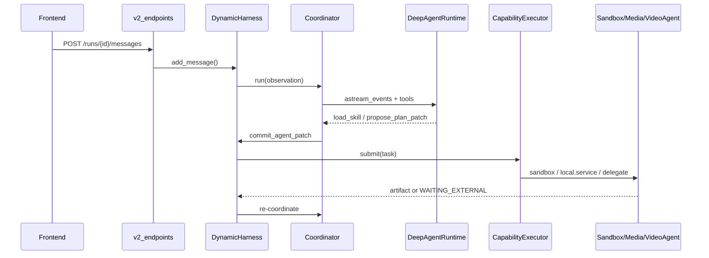
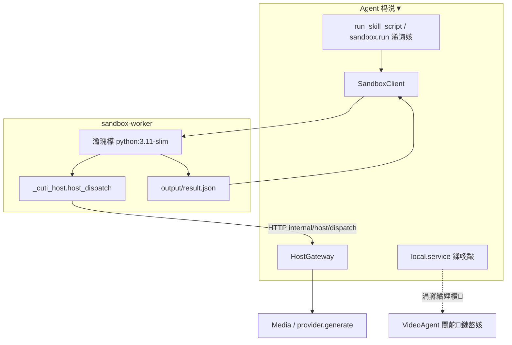

# Deep Agent V2锛氫唬鐮佽皟鐢ㄧ粨鏋勩€丼kill 鍔犺浇涓庢矙绠?

> 閫傜敤浠撳簱锛歚cuti-video-agent` / Deep Agent V2  
> 瀵圭収瀹炵幇锛歚app/chat/v2/*`銆乣app/chat/skills/*`銆乣services/sandbox-worker`  
> 鍚屾鏂囨。锛歔`deep-agent-v2-skills.html`](./deep-agent-v2-skills.html)锛堝惈 Mermaid 娴佺▼鍥撅級

---

## 1. 浠ｇ爜璋冪敤缁撴瀯锛堢鍒扮锛?

### 1.1 鍒嗗眰涓€瑙?

| 灞?| 浣嶇疆 | 鑱岃矗 |
|----|------|------|
| 鍓嶇 | `Cuti-frontend/src/features/deep-agent-v2/` | 鍒涘缓 run銆佸彂娑堟伅銆丼SE銆佸睍绀?artifact |
| HTTP API | `app/chat/api/v2/v2_endpoints.py` | `/chat-v1/service/v2/*` |
| Harness | `app/chat/v2/harness.py` (`DynamicHarness`) | 鎸佷箙鍖?run/task/artifact銆佹牎楠岃鍒掋€佽皟搴︽墽琛?|
| Coordinator | `app/chat/v2/coordinator.py` + `deep_agent_runtime.py` | LLM 鍗忚皟寰幆銆佽皟鐢ㄥ伐鍏?|
| Tools | `app/chat/v2/tools.py` | `list_skills` / `load_skill` / `propose_plan_patch` / `run_skill_script` 鈥?|
| Executor | `app/chat/v2/executors.py` (`CapabilityExecutor`) | 鎸?`executor` 鍒嗗彂鍒版矙绠?/ local.service / VideoAgent / MCP |
| 涓嬫父 | Media / VideoAgent / Provider / Sandbox Worker | 鐪熸浜у嚭濯掍綋涓庨樁娈电粨鏋?|

### 1.2 涓€娆＄敤鎴锋秷鎭殑涓昏矾寰?

```
鍓嶇 POST /v2/runs/{id}/messages
  鈫?DynamicHarness.add_message()
    鈫?DeepAgentCoordinator.run(observation)
      鈫?DeepAgentRuntime (LangGraph) 娴佸紡璋冪敤宸ュ叿
        鈫?list_skills / load_skill / read_skill_resource 鈥?
        鈫?propose_plan_patch 鈫?Harness.commit_agent_patch()
            鈫?PlanValidator
            鈫?钀藉簱 tasks 鈫?_schedule_ready 鈫?CapabilityExecutor.submit()
                鈹?sandbox.run      鈫?SandboxClient 鈫?sandbox-worker
                鈹?local.service   鈫?杩涚▼鍐?Python锛坥utline/character/media/鈥︼級
                鈹?video-agent.delegate 鈫?WorkflowClient 鈫?VideoAgent
                鈹?mcp.call        鈫?MCP bridge
            鈫?浜х墿鍐欏叆 ArtifactVersion 鈫?鍐嶅崗璋?
```

寮傛璺緞锛歚video-agent.delegate` 甯稿厛 `WAITING_EXTERNAL`锛岀敱  
`POST /v2/internal/video-agent/events` 鈫?`ingest_source_event` 鈫?瀹屾垚浠诲姟 鈫?鍐?`_coordinate`銆?

### 1.3 鍗忚皟鍣ㄥ伐鍏?vs 鑳藉姏鎵ц

| 鍏ュ彛 | 鏄惁浜х敓 capability 浠诲姟 | 鍏稿瀷鐢ㄩ€?|
|------|--------------------------|----------|
| `load_skill` / `read_skill_resource` | 鍚?| 璇绘寚浠や笌鍙傝€冩枃妗?|
| `run_skill_script` | 鍚︼紙鐩存帴璺戣剼鏈級 | instruction-only 鍖呭唴 `scripts/*.py`锛堝 seedance2锛?|
| `propose_plan_patch` | 鏄?| 鎻愪氦宸叉敞鍐?capability锛堝惈 `open_montage.tool.invoke`锛?|
| `skill_http_get` | 鍚?| 鎷夊叕寮€ HTTP 鍙傝€冭祫鏂?|

---

## 2. Skill 鍔犺浇閫昏緫

### 2.1 鏍圭洰褰曚笌淇′换绾у埆

閰嶇疆锛歚DEEP_AGENT_V2_SKILL_ROOTS`锛堥粯璁?`.system` + `external`锛夈€?

| 鏍?| 淇′换 | 鍙畨瑁?zip | 鍏佽鐨勫彲鎵ц executor |
|----|------|------------|------------------------|
| `skills/.system` | `trusted` | 鍚︼紙闅忎唬鐮佸彂甯冿級 | `local.service` / `video-agent.delegate` / `local.structured` / `mcp.call` / `sandbox.run` |
| `skills/external` | `untrusted` | 鏄?| **浠?* `sandbox.run`锛屾垨 **鏃?contract锛坕nstruction-only锛?* |

鍒ゅ畾锛歚path.parent.parent.name == ".system"` 鈫?trusted銆?

### 2.2 鍙戠幇涓庤В鏋愶紙`SkillCatalog`锛?

1. `discover()`锛氭瘡涓瓙鐩綍涓€浠?`SKILL.md`锛屾枃浠跺す鍚?= frontmatter `name`
2. 瑙ｆ瀽 YAML frontmatter锛歚name`銆乣description`锛堝繀濉級
3. 鍙€?` ```cuti-contract` JSON 鈫?`SkillContract`
4. `enabled = not (.cuti-disabled 瀛樺湪)`
5. 鏃?contract 鈫?**instruction-only**锛堜笉娉ㄥ唽 capability锛?
6. 鏈?contract 鈫?`capability_loader.manifest_from_skill()` 鈫?`CapabilityRegistry`

璧勬簮锛歚list_resources` / `read_resource` 閬嶅巻鍖呭唴鏂囦欢锛涜烦杩?`.cuti-*`銆佽矾寰勬浠?`.` 寮€澶寸殑鐩綍锛堝 `.filtered`锛夈€乻ymlink銆佷簩杩涘埗銆?

### 2.3 涓ょ被 Skill

| 绫诲瀷 | cuti-contract | 娉ㄥ唽 capability锛?| 鎵ц鏂瑰紡 |
|------|---------------|-------------------|----------|
| Instruction-only | 鏃?| 鍚?| LLM 鎸夎鏄庣粍鍚堝凡鏈?capability锛涙垨 `run_skill_script` |
| Executable | 鏈?| 鏄?| `propose_plan_patch` 鈫?Executor 鎸?`executor` 鎵ц |

绀轰緥锛?

- `open-montage`锛歩nstruction-only + 鍙€?`scripts/om_tools.py`
- `open-montage-tools`锛坄.system`锛夛細`local.service` 鈫?`open_montage_tool_invoke`
- `seedance2`锛歩nstruction-only + `scripts/seedance.py`锛堝钩鍙?Ark 妗ユ嫤鎴級
- `media-concat`锛歚.system` + `local.service` 鈫?`media_concat`

### 2.4 Runtime 渚ц櫄鎷熸枃浠?

`DeepAgentRuntime._load_skill_files()` 鎶婂凡鍚敤 skill 鐨?`SKILL.md` 鎸傚埌 deepagents 铏氭嫙 FS锛歚/skills/{name}/SKILL.md`锛堝彧璇伙級銆傜儹鍔犺浇鏃惰皟鐢?`reload_skill_files()`銆?

---

## 3. Skill 鐑姞杞介€昏緫

### 3.1 鍏ュ彛

```http
POST /chat-v1/service/v2/internal/skills/reload
Authorization: Bearer <CUTI_SERVICE_TOKEN>
```

瀹炵幇锛歚reload_v2_skills()`锛坄container.py`锛夛細

1. `reload_registry(capabilities, catalog, extra=MCP鈥?` 鈫?`catalog.reload()` + 閲嶅缓 registry
2. `_apply_runtime_policy`锛堟矙绠卞叧闂垯绂佺敤 `sandbox.run`锛?
3. `_runtime.reload_skill_files()`
4. 杩斿洖 skill 鏁伴噺

瀹夎 / 鍒犻櫎 / enable 鍚庡悓鏍蜂細瑙﹀彂 reload銆?

### 3.2 鐑姞杞借兘鍒锋柊浠€涔?

| 瀵硅薄 | 鐑姞杞藉悗鐢熸晥锛?|
|------|----------------|
| 纾佺洏涓婄殑 `SKILL.md` / 璧勬簮 md / scripts | 鏄紙闇€ reload锛?|
| Capability 娉ㄥ唽琛?| 鏄?|
| `.cuti-disabled` 寮€鍏?| 鏄?|
| MCP 閰嶇疆瑙ｆ瀽 | 鏄紙璇诲綋鍓?env锛?|
| Coordinator 閫氳繃 `list_skills` / `list_capabilities` 鐪嬪埌鐨勫唴瀹?| 鏄紙鎸佹湁鍚屼竴瀵硅薄寮曠敤锛?|

### 3.3 鐑姞杞戒笉鑳藉崟鐙悶瀹氫粈涔堬紙闇€鏀逛唬鐮?+ 閲嶅惎杩涚▼锛?

| 鍙樻洿 | 鍘熷洜 |
|------|------|
| 鏂板 `local.service` 鐨?`target` 鍒嗘敮 | `executors.py` 纭紪鐮?|
| 鏂板 `HostGateway` capability | `host_gateway.py` |
| 鏀圭郴缁?prompt / 鍗忚皟绛栫暐 | `deep_agent_runtime._system_prompt()` 鍚姩鏃舵瀯寤?|
| 閲嶅缓 LangGraph / 宸ュ叿缁撴瀯 | `runtime.initialize()` 涓嶅湪 reload 涓噸璺?|
| 鏂?VideoAgent 闃舵鏈嶅姟 | 闇€鎺ュ叆 executor + 鏈嶅姟浠ｇ爜 |
| `DEEP_AGENT_V2_ENABLED` / 妯″瀷 / DB 鎺ョ嚎 | 浠呭惎鍔ㄦ椂璇诲彇 |

**缁撹锛?* 鐑姞杞藉埛鏂扮殑鏄€岀洰褰曢噷鐨?Skill 鍖?+ 娉ㄥ唽琛ㄣ€嶏紝涓嶆槸銆孉gent Python 閫昏緫銆嶃€?

---

## 4. 浠€涔堟槸娌欑锛熸矙绠遍€昏緫鏄粈涔堬紵

### 4.1 瀹氫箟

**娌欑锛圫andbox锛?* = 鐙珛鐨?**sandbox-worker** 鏈嶅姟锛屽湪闅旂瀹瑰櫒锛堥粯璁?`python:3.11-slim`锛夐噷鎵ц Skill 鍖呬腑鐨?Python/Shell锛屾妸缁撴灉鍐欐垚 `output/result.json`锛屽啀鐢?Agent 鏀舵垚 artifact銆?

- Worker锛歚cuti-video-agent/services/sandbox-worker`
- 瀹㈡埛绔細`app/chat/v2/sandbox_client.py`锛坄SandboxClient`锛?
- 寮€鍏筹細`DEEP_AGENT_V2_SANDBOX_ENABLED`锛堥粯璁ゅ父涓?`false`锛涘叧闂椂 `sandbox.run` capability 娉ㄥ唽浣?`enabled=false`锛?

### 4.2 涓ゆ潯杩涙矙绠辩殑璺緞

#### A. `propose_plan_patch` 鈫?`executor: sandbox.run`

1. Skill 甯﹀畬鏁?`cuti-contract` + `sandbox` 绛栫暐锛坋ntrypoint銆乼imeout銆乶etwork銆乤llowed_domains銆乤llowed_host_capabilities锛?
2. Harness 璋冨害浠诲姟 鈫?`SandboxClient.run()`
3. 鎵撳寘鏁翠釜 skill 鐩綍 + `input.json` + 娉ㄥ叆 `_cuti_host.py`
4. `POST {SANDBOX_WORKER_URL}/v1/runs` 鈫?杞 鈫?璇?`output/result.json`

#### B. `run_skill_script`锛堟棤 contract 涔熷彲锛?

1. 鍗忚皟鍣ㄧ洿鎺ヨ皟宸ュ叿锛岃矾寰勫繀椤诲湪 `scripts/` 涓?
2. 鍚屾牱杩?sandbox-worker锛屼絾绛栫暐鏇村亸銆岃窇鑴氭湰銆?
3. 鍙敞鍏?Ark protocol bridge锛堣涓婃父 `seedance.py` 涓嶆敼婧愮爜涔熻兘璧?WaveSpeed锛?

### 4.3 Host Gateway锛堟矙绠卞洖璋冨涓伙級

娌欑榛樿鏃犲叕缃?/ 鏃犳湰鏈虹壒鏉冦€傞渶瑕佸钩鍙拌兘鍔涙椂锛岄€氳繃娉ㄥ叆鐨?`host_dispatch(capability, payload)` 鍥炶皟锛?

```
Sandbox 鈫?POST /v2/internal/host/dispatch 鈫?HostGateway.dispatch()
```

褰撳墠瀹夸富鑳藉姏锛坄SUPPORTED_HOST_CAPABILITIES`锛夛細

- `http.fetch` / `http.request`锛堝煙鍚嶇櫧鍚嶅崟锛岀簿纭尮閰嶏級
- `artifact.read` / `artifact.write` / `log` / `progress`
- `media.concat` / `media.extract_frame` / `media.trim` / `media.speed_adjust`
- `provider.generate`

**娉ㄦ剰锛?* 娌欑 **涓嶈兘** 鐩存帴璋冪敤浠绘剰 `local.service` target锛涢偅鏄?Agent 杩涚▼鍐呮墽琛屻€?

### 4.4 涓?`local.service` 瀵规瘮

| | 娌欑 `sandbox.run` | 杩涚▼鍐?`local.service` |
|--|--------------------|-------------------------|
| 杩涚▼ | sandbox-worker 瀹瑰櫒 | Agent uvicorn |
| 淇′换 | external 鍙儹瑁?| 浠?`.system` trusted |
| 鎵╁睍鏂瑰紡 | 鏀?Skill 鍖?+ reload | 鏀?`executors.py` + 閲嶅惎 |
| 鍏稿瀷 | 绗笁鏂硅剼鏈€侀殧绂绘墽琛?| outline/character/media 妗?|

---

## 5. 浠€涔堟牱鐨?Skill 鍙洿鎺ョ儹鍔犺浇锛熶粈涔堟牱鐨勮繕瑕佹敼浠ｇ爜閫傞厤锛?

### 5.1 鍙洿鎺ョ儹鍔犺浇浣跨敤锛堟帹鑽愯矾寰勶級

婊¤冻浠讳竴鍗冲彲锛?*鏃犻渶鏀?Agent 婧愮爜**锛堣鍖?+ `skills/reload`锛夛細

1. **Instruction-only**  
   - 鍙湁 `SKILL.md` + 鍙傝€?md  
   - 鏁?LLM 缁勫悎宸叉湁 capability锛坄outline.generate`銆乣media.concat`銆乣api.provider.generate`鈥︼級  
   - 渚嬶細杩囨护鍚庣殑 `open-montage` 鎸囦护闈?

2. **Instruction-only + `scripts/`**  
   - 鑴氭湰鍙緷璧栧涓诲凡鏈夎兘鍔?/ 鍏紑 HTTP / Ark 妗? 
   - 渚嬶細`seedance2/scripts/seedance.py`

3. **Executable external锛歚executor: sandbox.run`**  
   - 鑷甫 entrypoint锛岃緭鍑?`result.json`  
   - 浠呭０鏄庡凡瀛樺湪鐨?`allowed_host_capabilities`  
   - 鐢?install-archive 瀹夎

4. **鍚仠宸插瓨鍦?Skill**  
   - 澧炲垹 `.cuti-disabled` 鎴?`PATCH .../enabled`

### 5.2 闇€瑕佷唬鐮佽皟鏁村啀閫傞厤

鍑虹幇涓嬪垪闇€姹傛椂锛?*涓嶈兘**鍙潬鐑姞杞斤細

| 闇€姹?| 閫傞厤浣嶇疆 |
|------|----------|
| 鏂扮殑杩涚▼鍐呴樁娈碉紙鏂?DB/涓氬姟鏈嶅姟锛?| 鏂?VideoAgent service + `executors.py` `elif service_target == ...` + `.system` SKILL |
| 鏂扮殑瀹夸富濯掍綋/鐢熸垚鑳藉姏 | `host_gateway.py` +锛堝彲閫夛級Media API + SandboxPolicy 鐧藉悕鍗?|
| 鎶?OM 宸ュ叿鍚嶆槧灏勫埌 Cuti | `open_montage_bridge.py` + `.system/open-montage-tools` |
| 鏀瑰崗璋冮粯璁ょ瓥鐣?/ 绂?master pipeline 鏂囨 | `deep_agent_runtime.py` 绯荤粺鎻愮ず |
| `video-agent.delegate` 鏂?agent/mode | WorkflowClient + VideoAgent 鍥?|
| External 鎯崇敤 `local.service` | **涓嶅厑璁?*锛涘簲鏀逛负娌欑锛屾垨鍋氭垚 `.system` 鍙俊 Skill |

### 5.3 鍐崇瓥閫熸煡

```
瑕佷笉瑕佹敼 Agent 浠ｇ爜锛?
鈹?
鈹溾攢 鍙敼璇存槑鏂囨。 / 杩囨护璧勬簮 / 缁勫悎鐜版湁鑳藉姏
鈹?    鈫?鐑姞杞斤紙instruction-only锛?
鈹?
鈹溾攢 绗笁鏂硅剼鏈紝杈撳嚭鏍囧噯 artifact锛屼笖鍙敤宸叉湁 host 鑳藉姏
鈹?    鈫?鐑姞杞斤紙sandbox.run 鎴?run_skill_script锛?
鈹?
鈹溾攢 闇€瑕?Agent 杩涚▼鍐呯洿鎺ヨ皟 DB / 闃舵鏈嶅姟 / 鏂?Media API
鈹?    鈫?鏀?executors / host_gateway / 鏈嶅姟浠ｇ爜锛岀劧鍚庨噸鍚?
鈹?
鈹斺攢 闇€瑕佹柊銆屼骇鍝佺骇銆峜apability 缁欐墍鏈夌敤鎴?
      鈫?`.system` SKILL + 浠ｇ爜 target锛岃蛋鍙戝竷娴佺▼锛堥潪 zip 鐑锛?
```

### 5.4 褰撳墠浜у搧瀹炰緥

| Skill | 绫诲瀷 | 鐑姞杞斤紵 | 澶囨敞 |
|-------|------|----------|------|
| `open-montage` | instruction-only | 鏄?| 杩囨护鍚庣殑 Layer-2 璇存槑锛涙墽琛岄潬鐜版湁闃舵 + 妗?|
| `open-montage-tools` | `.system` local.service | 鍚︼紙浠ｇ爜闅忓彂锛?| `open_montage.tool.invoke` |
| `seedance2` | instruction + script | 鏄?| 骞冲彴 Ark鈫扺aveSpeed 妗ワ紝涓嶆敼 Skill 姝ｆ枃 |
| `media-concat` / `media-extract-frame` | `.system` | 鍚?| 缁戝畾 HostGateway |
| `generate-outline` 绛夐樁娈?| `.system` | 鍚?| `local.service` 鈫?VideoAgent 鏈嶅姟 |
| `generate-video-pipeline` | `.system` + `.cuti-disabled` | 鍚仠鍙儹鍒?| executor 鏈韩闇€浠ｇ爜鏀寔锛涘綋鍓嶇鐢?|

---

## 6. 鍏抽敭鏂囦欢绱㈠紩

| 鏂囦欢 | 瑙掕壊 |
|------|------|
| `app/chat/v2/container.py` | 鍚姩鎺ョ嚎銆乣reload_v2_skills` |
| `app/chat/v2/skill_catalog.py` | 鍙戠幇銆佷俊浠汇€乧ontract銆佽祫婧?|
| `app/chat/v2/capability_loader.py` | Skill 鈫?CapabilityManifest |
| `app/chat/v2/harness.py` | 璁″垝銆佽皟搴︺€佸畬鎴?|
| `app/chat/v2/executors.py` | 鎵ц鍣ㄥ垎鍙?|
| `app/chat/v2/sandbox_client.py` | 娌欑瀹㈡埛绔?|
| `app/chat/v2/host_gateway.py` | 瀹夸富鑳藉姏 |
| `app/chat/v2/deep_agent_runtime.py` | LangGraph + 绯荤粺鎻愮ず + skill 鏂囦欢 |
| `app/chat/v2/tools.py` | 鍗忚皟鍣ㄥ伐鍏?|
| `skills/EXTERNAL_SKILL_AUTHORING.md` | 澶栭儴 Skill 鎾板啓瑙勮寖 |
| `services/sandbox-worker/` | 闅旂鎵ц鏈嶅姟 |

---

## 7. 娴佺▼鍥撅紙Mermaid锛?

涓嬪垪鍥句笌 HTML 鐗堜竴鑷达紝鍙湪鏀寔 Mermaid 鐨勯瑙堝櫒涓覆鏌撱€?

### 7.1 绔埌绔皟鐢?



### 7.2 Skill 鍙戠幇涓庢敞鍐?

```mermaid
flowchart LR
    A[".system / external 鏍圭洰褰?] --> B[SkillCatalog.discover]
    B --> C{鏈?cuti-contract?}
    C -->|鍚 D[Instruction-only<br/>浠呮寚瀵?LLM]
    C -->|鏄瘄 E[capability_loader]
    E --> F{trusted?}
    F -->|untrusted 涓旈潪 sandbox.run| G[鎷掔粷/绂佺敤]
    F -->|鍏佽| H[CapabilityRegistry]
    D --> I[DeepAgentRuntime.skill_files]
    H --> J[PlanValidator / Executor]
    I --> K[list_skills / load_skill]
```

### 7.3 鐑姞杞?

```mermaid
flowchart TD
    U[鏀圭鐩?Skill 鍖?/ install / .cuti-disabled] --> R[POST /internal/skills/reload]
    R --> C[catalog.reload]
    C --> G[build_registry / replace_all]
    G --> P[_apply_runtime_policy]
    P --> F[runtime.reload_skill_files]
    F --> OK[list_skills / list_capabilities 绔嬪嵆鍙]
    X[鏀?executors / host_gateway / 绯荤粺鎻愮ず] --> Y[闇€閮ㄧ讲浠ｇ爜骞堕噸鍚繘绋媇
```

### 7.4 娌欑涓庡涓?



### 7.5 鐑姞杞?vs 鏀逛唬鐮佸喅绛?

```mermaid
flowchart TD
    Q{Skill 闇€瑕佷粈涔?}
    Q -->|鍙璇存槑 + 缁勫悎鐜版湁 capability| H1[鐑姞杞?Instruction-only]
    Q -->|scripts 鍙敤宸叉湁 host/Ark 妗 H2[鐑姞杞?+ run_skill_script]
    Q -->|瀹屾暣 vendor 閫昏緫 + sandbox.run 鍚堝悓| H3[zip 瀹夎 + reload]
    Q -->|鏂?DB 闃舵 / 鏂?Media API / 鏂?host cap| C1[鏀?Agent 浠ｇ爜 + 閲嶅惎]
    Q -->|浜у搧绾?local.service| C2[鍋氭垚 .system + executor 鍒嗘敮]
```
